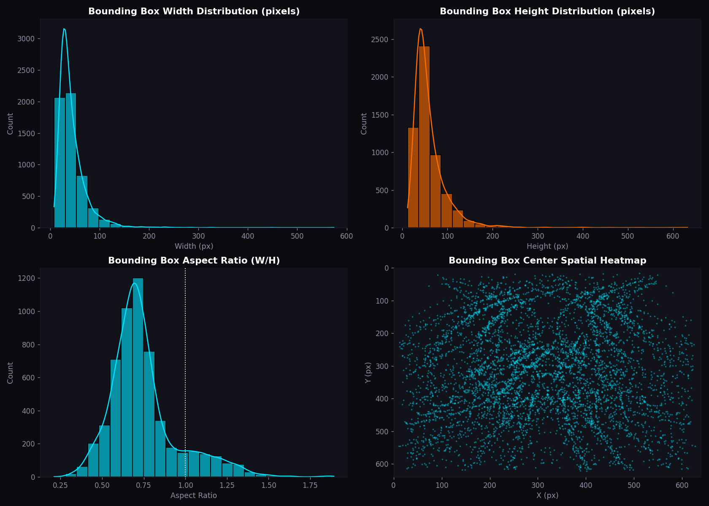

# Real-Time Traffic Density Estimation using YOLO11

**An advanced computer vision solution for real-time vehicle detection and dual-lane traffic density estimation using YOLO11 Nano and OpenCV.**

[](https://www.python.org/)
[](https://docs.ultralytics.com/)
[](https://opencv.org/)
[](https://onnx.ai/)
[](LICENSE)

### 🔗 [**View the Live Interactive Dashboard →**](https://alinaderiii.github.io/Real-Time-traffic-density-estimation/)


---

## 🌟 Features

- **State-of-the-art Vehicle Detection** with **YOLO11 Nano**
- **Real-time Traffic Intensity Analysis** (Smooth / Heavy)
- **Dual-lane ROI-based Counting** using OpenCV polygon regions
- **High Accuracy**: 97.4% mAP50 | 94.7% Recall | 91.2% Precision
- **ONNX Export** ready for deployment (C++ / OpenCV)
- **Interactive Dashboard** showcasing results, metrics, and video inference
- **Comprehensive EDA** and training visualization

---

## 📊 Project Overview

This project implements an end-to-end pipeline for estimating traffic density from top-view highway camera feeds. The system detects vehicles using a custom-trained **YOLO11** model and classifies them into left and right lanes using predefined polygonal regions of interest (ROI).

**Key Achievements:**

- Successful migration from YOLOv8 to **YOLO11**
- Training completed in ~30 minutes on GTX 1650 with CUDA
- Robust handling of Windows Unicode paths
- Clean dataset with zero annotation errors

---

## 🛠️ Tech Stack

| Component | Technology |
|---|---|
| Object Detection | YOLO11 Nano (Ultralytics) |
| Computer Vision | OpenCV |
| Training | PyTorch + CUDA |
| Model Export | ONNX |
| Visualization | Matplotlib, Seaborn |
| Dashboard | HTML + CSS + JavaScript |
| Notebooks | Jupyter Notebook |

---

## 📈 Results

| Metric | Score |
|---|---|
| **mAP50** | 97.4% |
| **mAP50-95** | 72.4% |
| **Precision** | 91.2% |
| **Recall** | 94.7% |

Strong performance even under shadows and glare.



---

## 🧪 Dataset

| Property | Value |
|---|---|
| Total Images | 626 (640×640) |
| Train | 536 images (horizontal flip augmentation) |
| Validation | 90 images |
| Class | Vehicle (single class) |
| Format | YOLOv8 label format |

---

## 📁 Project Structure

```text
Real-Time-traffic-density-estimation/
├── index.html                              # Interactive dashboard (GitHub Pages)
├── best.onnx                               # Exported model (ONNX)
├── processed_sample_video.mp4              # Inference output video
├── results.png                             # Training convergence curves
├── confusion_matrix_normalized.png         # Normalized confusion matrix
├── BoxPR_curve.png                         # Precision-Recall curve
├── eda_box_distributions.png               # Bounding box distributions
├── Traffic_Density_Advanced_Modeling.ipynb # Training + inference notebook
├── Traffic_Density_Advanced_Modeling.html  # Rendered notebook
├── Traffic_Density_Advanced_EDA.ipynb      # EDA notebook
├── Traffic_Density_Advanced_EDA.html       # Rendered notebook
├── data.yaml                               # YOLO dataset config
├── README.dataset.txt                      # Dataset notes
├── LICENSE
└── README.md
```

---

## 🔧 How to Run

**1. Clone the repository**

```bash
git clone https://github.com/AliNaderiii/Real-Time-traffic-density-estimation.git
cd Real-Time-traffic-density-estimation
```

**2. View the dashboard**

Open `index.html` in any browser, or visit the
[live version](https://alinaderiii.github.io/Real-Time-traffic-density-estimation/).

**3. Run inference with the exported ONNX model**

```bash
pip install ultralytics opencv-python
```

```python
from ultralytics import YOLO

model = YOLO("best.onnx")

# Single image
results = model.predict("your_image.jpg", conf=0.25)
results[0].show()

# Video file
results = model.predict("your_video.mp4", stream=True, conf=0.25)
for r in results:
    print(f"Vehicles detected: {len(r.boxes)}")
```

**4. Lane classification logic**

```python
# Classify each detection against the lane separator (x = 609 px)
lane_threshold = 609
left_lane = right_lane = 0

for box in r.boxes:
    x_center = (box.xyxy[0][0] + box.xyxy[0][2]) / 2
    if x_center < lane_threshold:
        left_lane += 1
    else:
        right_lane += 1

heavy_traffic_threshold = 10
intensity = "Heavy" if (left_lane + right_lane) > heavy_traffic_threshold else "Smooth"
```

---

## 📌 Future Improvements

- [ ] Multi-camera support
- [ ] Speed estimation (km/h)
- [ ] Web deployment (FastAPI + WebSocket)
- [ ] Vehicle type classification (Car, Truck, Bus, etc.)
- [ ] Edge deployment on NVIDIA Jetson

---

## 👨‍💻 Author

**Ali Naderi** — AI Engineer & Data Scientist
Dublin, Ireland

- 🌐 Portfolio: [alinaderiii.github.io](https://alinaderiii.github.io/)
- 📊 Live dashboard: [Traffic Density Estimation](https://alinaderiii.github.io/Real-Time-traffic-density-estimation/)
- 💼 LinkedIn: [alinaderi-data-scientist](https://www.linkedin.com/in/alinaderi-data-scientist)
- 🐙 GitHub: [@AliNaderiii](https://github.com/AliNaderiii)
- 📈 Kaggle: [alinaderi1](https://www.kaggle.com/alinaderi1)
- 📧 alinaderi119@gmail.com

---

## 📄 License

Released under the [MIT License](LICENSE). Free to use for educational and portfolio purposes.

---

<sub>Made with ❤️ using YOLO11</sub>
